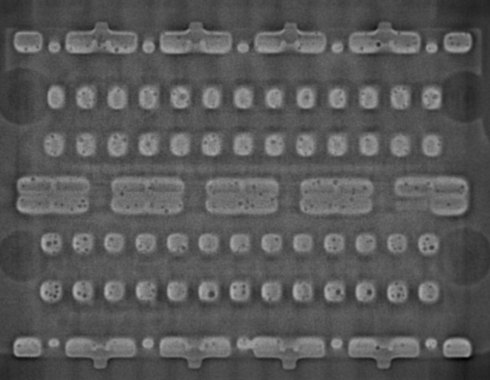

# Pseudo-X-ray-Image-Recognition-Utilizing-Machine-Learning

## Chapter 1: Introduction
The project focuses on the use of Autoencoders for the classification of X-ray images to automate defect detection in a production line. Specifically, it classifies X-ray images into two categories: "io" (in order, representing correctly soldered joints) and "nio" (not in order, representing defective solder joints). The primary goal is to improve the efficiency and accuracy of the inspection process by using machine learning techniques, with a focus on leveraging Autoencoders for image classification.

## Chapter 2: Data Preparation
In this chapter, the X-ray images are processed and prepared for model training. The dataset is divided into two classes ("io" and "nio"), and the images are preprocessed through resizing, normalization, and augmentation. The augmentation steps, including flipping and rotation, are particularly important to address class imbalance and improve model generalization. The processed images are then transformed into tensors for use with the model.

## Chapter 3: Model Training and Evaluation
This chapter details the training and evaluation of a supervised Autoencoder model for binary image classification of X-ray images. Autoencoders are well-suited for image classification tasks, especially with imbalanced data. The model consists of two parts: the encoder, which reduces input data to a lower-dimensional representation, and the decoder, which reconstructs the original input from this compressed form. The architecture utilizes Convolutional Neural Networks (CNNs) and applies layers like convolution, pooling, and dropout to extract features and reduce overfitting.

### Model Training
The model is trained using the Adam optimizer and cross-entropy loss, with class weights to address class imbalance. Early stopping is implemented to prevent overfitting by halting training when the validation loss fluctuates excessively. The model is trained on the training dataset while being evaluated on the validation set.

### Model Evaluation
After training, the model is evaluated on a test set. Accuracy alone is not enough due to data imbalance, so recall and F1-score metrics are used. The model achieves a recall rate of 100% on the test data, indicating high performance. The model's parameters are saved for future use, avoiding the need for retraining.

### Prediction on New Images
The trained model is tested on new, unseen images. It accurately predicts the correct labels for all images, demonstrating its robustness.

### Class Activation Map (CAM)
The class activation map (CAM) is used to visualize the features the model focuses on during classification. Two gradient-based methods, SmoothGradCAMpp and XGradCAM, are implemented to generate these maps, providing insight into the model’s decision-making process.

# Conclusion
The use of a supervised autoencoder for this binary image classification task significantly improves model performance. The hybrid approach of unsupervised pretraining combined with supervised fine-tuning allows for the extraction of relevant features and discriminative representations for effective classification.
